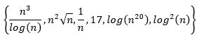

## Problemas P e NP

### Problemas de classe P

Os problemas de calsse P são os que apresentam soluções tais, que podem ser resolvidos de maneira eficiente
e apresentam um custo de tempo polinomial.

O P, vem de tempo polinomial determinístico, portanto todos os problemas que estiverem em P devem atender a uma série de
exigências:

- Deve existir uma linguagem L que está em P se e somente se existir uma máquina de Turing determinística M, que atende
  aos seguintes requisitos:

1. M irá gastar um tempo polinomial para qualquer entrada do problema
2. Cada x em L produz uma saída 1 para M;
3. Para cada x que não faz parte de L, a máquina M irá gerar o valor 0

#### Problemas em P

1. Caminho mais curto;
2. Alinhamento
3. Barra

### Problemas de classe NP

### Problemas de classe NPC

----

### Conhecimentos

Umas das aplicações da notação Theta (Θ) é estabelecer uma métrica para comparação de funções.
Com isso, um dado conjunto de funções pode ser ordenado de maneira a identificar aquelas que têm maior e menor
crescimento assintótico.

Considerando o seguinte conjuntos de funções:

Resposta correta.
Como n é linear no seu crescimento, a função 1/n
decresce rapidamente,
o que a torna a função com
menor limite assintótico,
seguida da função constante 17.
Na sequência, como log(n20) = 20log(n) é T(log(n)), temos que ela cresce a uma taxa inferior que seu quadrado, log2(n).
Logo, log(n20) e log2(n) são as próximas. Para a definição das duas últimas funções, é preciso perceber que cresce a uma
taxa superior que log(n). Então, temos que Portanto, as duas últimas funções são nesta ordem.



----
O cálculo de complexidade é parte essencial do projeto e da análise de algoritmos. Uma ferramenta chave usada nesta
atividade é a notação Theta (Θ). Ela oferece uma maneira objetiva de descrever o comportamento assintótico de algoritmos
e possibilita a comparação da eficiência entre eles.

Considerando as funções T1(n) = log2n + n e T2(n) = n, analise as asserções a seguir e a relação proposta entre elas.

I. Um algoritmo A2 com uma complexidade T2 tem uma eficiência computacional melhor que um algoritmo A1 com complexidade
T1.

Porque:

II. A função T1 tem limite assintótico dado por T1(n) = Θ(T2(n)).

A seguir, assinale a alternativa correta.

A asserção I é uma proposição falsa, e a II é uma proposição verdadeira.

Resposta correta.

É preciso observar que n = O(log2n + n). Adicionalmente, temos que verificar se log2n + n = O(n), ou
seja, log2n + n = cn, c > 0. Como log2n = n (pois n = 2n), temos que log2n + n = 2n, tomando c = 2 e n = 1. Portanto,
T1(n) = T(T2(n)).

----

```
O desempenho no pior caso de um algoritmo pode ser descrito por meio do uso da notação de complexidade assintótica. Esse é o caso de algoritmos que solucionam problemas de tamanho n, que tem seu tamanho reduzido a cada iteração.

 

Analise o algoritmo a seguir:

Algoritmo A

Entrada: Inteiro de valor positivo

Saída: Valor 1 se o valor informado for 1

1. se n = 1 então

2.        retornar 1

3. senão

4.        retornar 2 × A(n/2) + 1

 

Considerando essas informações e o algoritmo apresentado, analise as afirmativas a seguir e assinale V para a(s) verdadeira(s) e F para a(s) falsa(s).

 

I. (F) A solução fechada da recorrência para o algoritmo pode ser descrita pela função T(n) = (n - 1) + c, em que c é uma constante positiva.

II. (F) O algoritmo gera subproblemas, cujos tamanhos são ¼ do tamanho do subproblema da iteração anterior.

III. (V) O algoritmo tem como chamada recursiva um comando que gera subproblemas de tamanho n/2.

IV. (V) O limite superior da recorrência que descreve o algoritmo pode ser expressa por T(n) = O(log(n)).

 

Agora, assinale a alternativa que apresenta a sequência correta:


```

```
Resposta correta. Este algoritmo tem como recursão uma chamada a “A(n/2)”, ou seja, a solução de um problema de tamanho igual a n é reduzida à solução de um problema de tamanho igual a n/2 mais algum tempo constante - k1, para multiplicar o resultado por 2 e somar 1. A solução do problema para o caso base é resolvido em um tempo constante - k2. Assim, a relação de recorrência que descreve o comportamento do algoritmo pode ser descrita pela seguinte função: T(n) = 2T(n/2) + k1 (em que k1 é constante) e T(1) = k2 (em que k2 é constante).  Supondo que T(n) = O ( log n ), pelo método da substituição temos

T(n)    = 2log(n/2) + k1

            = 2(log(n) - log 2) + k1

            = 2 log(n) - 2 + k1      (k1  <  2)

= 2log(n)

= O( log n )

Logo, a solução da relação de recorrência é T(n) = O ( log n ).
```

-----

```
Um dos métodos amplamente utilizados para a solução de recorrências é conhecido como o método da substituição. Sua aplicação é baseada na proposição de uma solução fechada para a recorrência, seguida de uma validação dessa solução.

 

Considerando o uso desse método para verificar se O(n2) é solução para a recorrência T(n) = T(n - 1) + n, analise as afirmativas a seguir.

 

I. Após a construção da desigualdade inicial, o próximo passo envolve a avaliação de n na solução proposta.

II. Um dos passos da resolução envolve a avaliação de uma diferença, elevada à potência de 2, entre dois termos.
(ok)
III. A aplicação do método se inicia com a construção da desigualdade T(n) ≤ c(n2 - n), onde c > 0.

IV. A conclusão da aplicação do método é que a solução proposta resolve a recorrência em questão.
(ok)


Está correto apenas o que se afirma em:
```

```
Resposta correta. 
A aplicação do método implica nos seguintes passos:

T(n)     = T(n – 1) + n          

            = c(n – 1)2 + n

            = cn2 – 2cn + c + n

            = cn2 – n(2c – 1) + c

            = O(n2)

Logo, O(n2) é solução para a recorrência.
```

-------

```
Saber analisar uma recorrência a partir da descrição de um dado problema, é importante para a correta avaliação da complexidade do algoritmo que será projetado. E o entendimento de como cada subproblema é expandido deve ser parte integrante dessa análise. Considere um algoritmo recursivo que, dada uma entrada de tamanho n, divide a entrada em 2 (dois) subproblemas de tamanho n/2, resolve cada um recursivamente e, por fim, combina as duas partes em um tempo O(n).

 

Em relação ao comportamento recursivo e ao limite assintótico desse algoritmo, analise as afirmativas a seguir (o tempo de execução do algoritmo para uma entrada de tamanho n será denotado por T(n)).

 

I. A árvore de recursão gerada pelo algoritmo terá tamanho log2(n).

II. Cada nível k da árvore de recursão é composto por 2k subproblemas.

III. O algoritmo tem complexidade da ordem de O(nlog2)

IV. A recursão pode ser descrita pela função T(n) = T(2n) + n.

 

Está correto apenas o que se afirma em:
```

```
Resposta correta. 
Seja k = {1, 2, …, K} denotar os níveis da árvore de recursão. 
Neste caso, k = 1 corresponde ao problema original de tamanho n, k = 2 é o primeiro nível da recursão 
com dois subproblemas de tamanho n/2 e, seguindo a expansão, no nível K, teremos 2k subproblemas, cada um com tamanho n/2k e, no nível K, os subproblemas terão tamanho 1. Isso quer dizer que a altura da árvore será dada por log2(n). A recursão pode ser descrita pela função T(n) = 2T(n/2) + O(n). Logo, os subproblemas serão de tamanho 1. Após K = log2(n), níveis recursivos e o tempo para resolver cada subproblema de tamanho 1 será de O(1). Além disso, para um subproblema de tamanho n, há o tempo extra de combinação O(n). Então, no nível de recursão k, haverá o custo extra de 2k × O(n/2k) = O(n). 
Portanto, a complexidade do algoritmo será de T(n) = O(nlog(n)).
```

-----

```
Funções de recorrência podem ser exploradas com várias manipulações algébricas de forma a encontrar uma solução fechada. Isso é particularmente importante para a descrição do comportamento assintótico de algoritmos. No entanto, é fundamental saber reconhecer semelhanças e diferenças entre elas.

 

Considerando a relação de recorrência a seguir, indique a alternativa correta a respeito dela:

T(1) = 1
T(n) = T(n - 1) + 3
```

```
Resposta correta. O caso base é constante O(1) 
e a relação é heterogênia, 
podendo apresentar termo independente. 
Se um termo n3 for acrescido à relação, esse passará a ser seu novo comportamento assintótico, 
o qual é O(n). Como a cada iteração o termo recursivo      é decrementado de 1, na k-ésima iteração,
 a relação será expressa por T(n – k) + 3k.
```

------

```
O limite assintótico de algoritmos recursivos pode ser estimado com boa precisão, através da modelagem via árvores de recursão. Para isso, os termos recursivos desempenham papel chave para o entendimento de como o algoritmo se comporta a cada iteração.

 

Considerando que um algoritmo é modelado pela recursão T(n) = T(n/3) + T(2n/3) + cn, onde c é uma constante, analise as afirmativas a seguir.

 

I. A árvore de recursão mostra que o custo de cada nível é cn.

II. O limite assintótico inferior do algoritmo é Ω(nlog(n)).

III. O caminho mais curto entre a raiz e um nó folha é log3(n).

IV. O tamanho dos subproblemas decresce a um fator de 2/3.

 

Está correto apenas o que se afirma em:
```

```
Resposta correta. Como os termos recursivos são divididos por 3, 
cada subproblema tem seu tamanho decrementado a um fator de 3. Porém, 
cada nível tem um acréscimo de cn termos, o que corresponde ao custo de cada nível. 
Para a definição do limite inferior do custo do algoritmo temos, 
cn(log3(n)) + 1 = cnlog3(n) = (c/log(3))nlog(n) = O(nlog(n)).
```
------

```
É comum que algoritmos sejam fracionados em múltiplos procedimentos que, quando executados de maneira conjunta, têm seus resultados parciais combinados para gerar a solução final. Essa divisão tem impacto direto no cálculo da complexidade do algoritmo. Um algoritmo ALG é composto de dois subalgoritmos ALGA e ALGB, que devem ser executados sequencialmente - ALGA seguido de ALGB. No entanto, dada uma função f(n), ambos subalgoritmos podem ser otimizados de forma que ALGA rode a uma taxa de Θ(f(n)) e ALGB à taxa de Θ(n/f(n)).

 

Considerando esse cenário, analise as asserções a seguir e a relação proposta entre elas.

 

I. O tempo de execução geral de ALG pode ser minimizado através da escolha de uma função .

Porque:

II. Como ambos subalgoritmos ALGA e ALGB, são executados sequencialmente, a função vai apresentar a menor taxa de crescimento no algoritmo completo.


```

```
Resposta correta. Como os dois subalgoritmos são executados sequencialmente, o tempo de execução total de ALG será dado por T(f(n) + n/f(n)) = T(max{ f(n), n/f(n) }).

Para que esse valor seja minimizado, é preciso definir f(n), de tal maneira que ambas as partes sejam iguais, ou seja:


f(n)=n/f(n) ?(f(n))^2=n?f(n)=vn
```